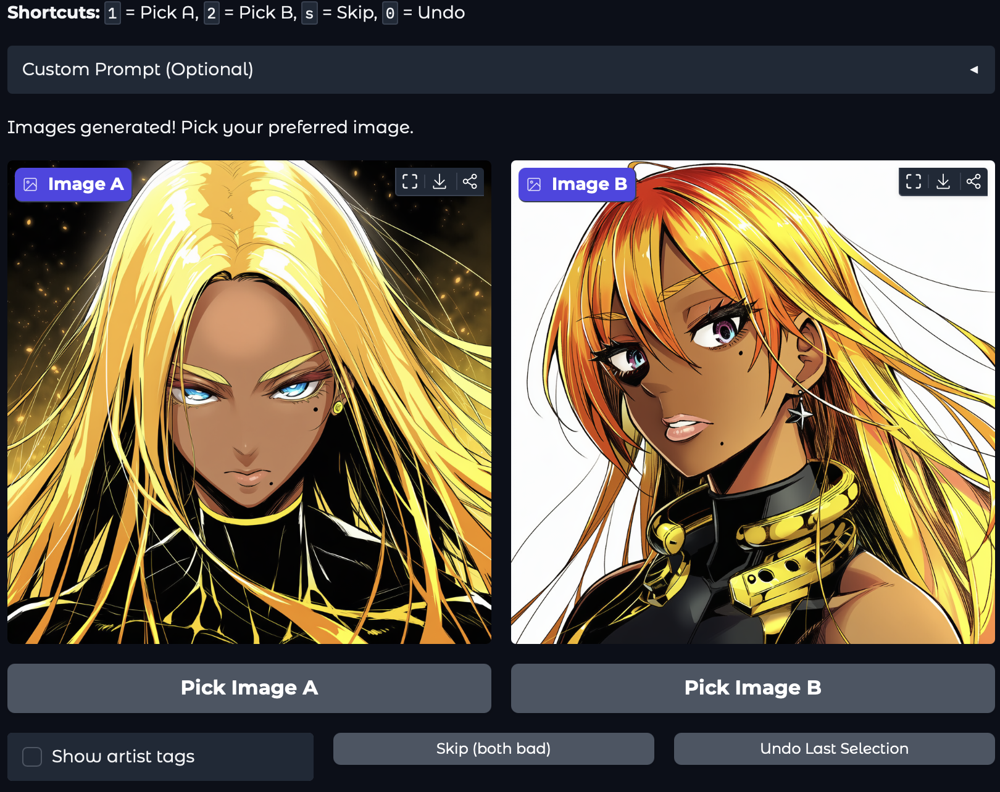
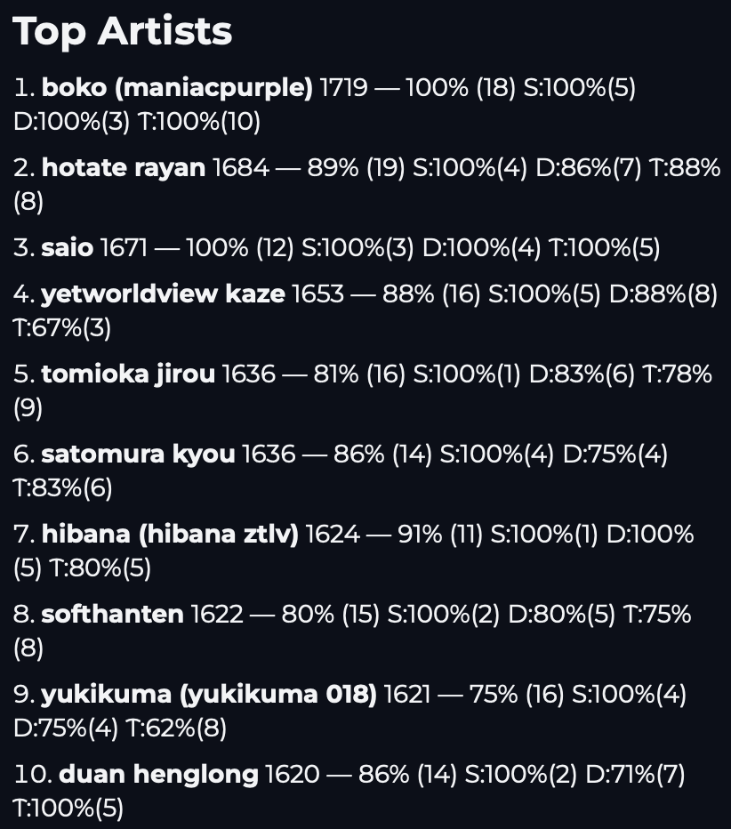
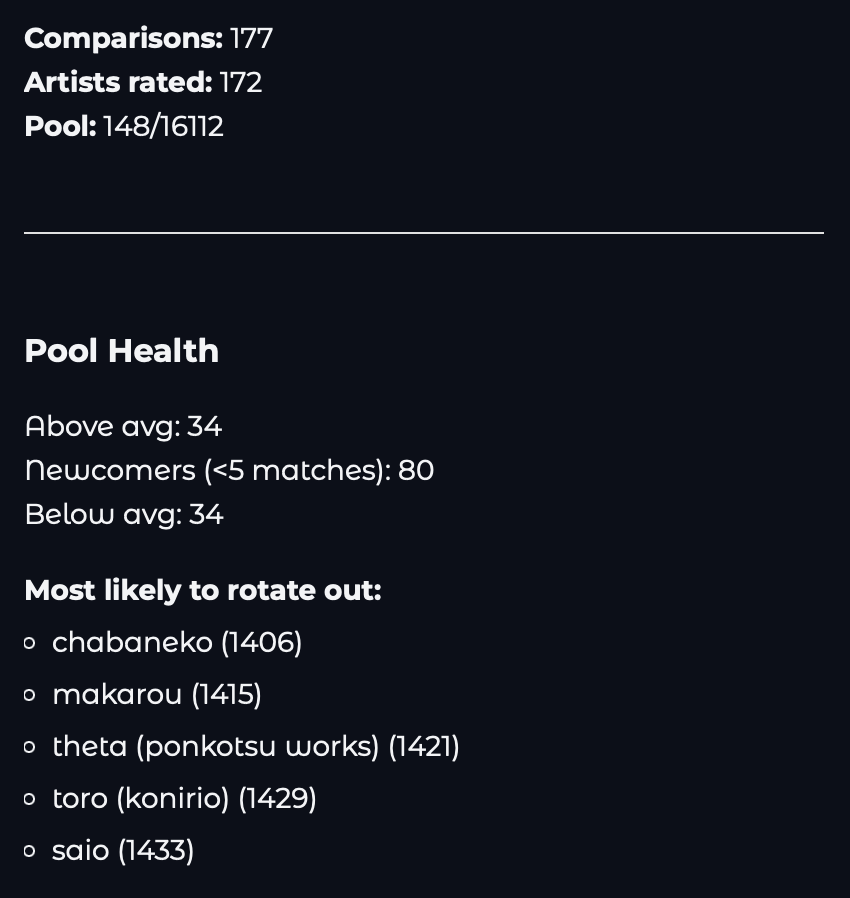
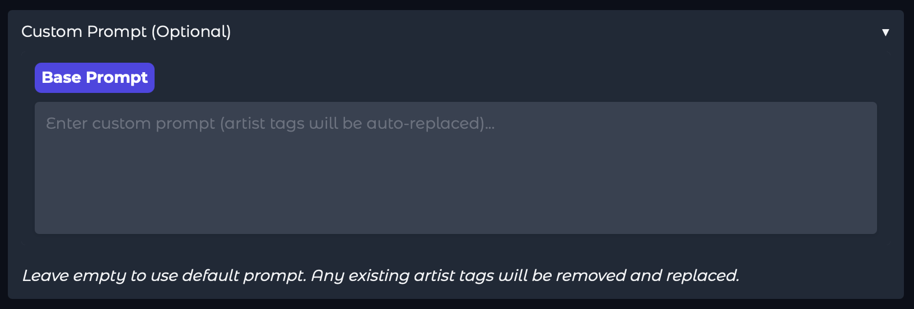

# Artist ELO Ranking System for NovelAI

A web-based blind comparison system that ranks Danbooru artist tags by generating AI images with [NovelAI](https://novelai.net/) and letting you pick your preferred results. Artists gain or lose ELO rating based on the outcomes.


## Features

- **Blind Comparisons**: Compare two AI-generated images without seeing which artists were used (toggleable)
- **ELO Rating System**: Individual-based ELO calculation with zero-sum enforcement
- **Active Pool Management**: Maintains a pool of ~150 artists for efficient ranking discovery
- **Smart Rotation**: Low performers are probabilistically rotated out; high ELO artists are more likely to return
- **Win Rate Statistics**: Track solo, duo, and trio performance for each artist
- **Undo Support**: Revert the last comparison if you change your mind
- **Keyboard Shortcuts**: Quick voting with `1`, `2`, `s` (skip), and `0` (undo)
- **Custom Prompts**: Use your own prompts while the system handles artist tag insertion

## Prerequisites

- Python 3.8 or higher
- A [NovelAI](https://novelai.net/) subscription with API access
- The artist tags file (`danbooru_artist_tags_v4.5.txt`)

## Installation

1. **Clone the repository**
   ```bash
   git clone https://github.com/Rlag1998/novelai-artist-elo.git
   cd novelai-artist-elo
   ```

2. **Create a virtual environment** (recommended)
   ```bash
   python -m venv venv
   source venv/bin/activate  # On Windows: venv\Scripts\activate
   ```

3. **Install dependencies**
   ```bash
   pip install -r requirements.txt
   ```

4. **Set up your API key**

   Copy the example environment file and add your NovelAI API key:
   ```bash
   cp .env.example .env
   ```

   Edit `.env` and replace `your-api-key-here` with your actual API key.

## Getting Your NovelAI API Key

1. Go to [NovelAI](https://novelai.net/) and log in
2. Navigate to **Account Settings**
3. Click **Get Persistent API Token**
4. Copy the token (starts with `pst-`)
5. Paste it into your `.env` file

> **Note**: API access requires an active NovelAI subscription (Tablet, Scroll, or Opus tier).

## Usage

1. **Start the application**
   ```bash
   python artist_elo_ranker.py
   ```

2. **Open the web interface**

   The application will automatically open your browser to `http://127.0.0.1:7860`

3. **Compare images**

   Two images will be generated with different artist combinations (1-3 artists each). Pick your preferred image to update the ELO ratings.

   

   - Click "Pick Image A" or "Pick Image B" to vote for your preferred image
   - Use keyboard shortcuts for faster voting:
     - `1` - Pick Image A
     - `2` - Pick Image B
     - `s` - Skip (both bad)
     - `0` - Undo last selection

4. **View rankings**

   The leaderboard on the right shows the top artists by ELO rating, along with their win rates and comparison counts.

   

### Understanding the Leaderboard

Each artist entry shows:
```
1. artist_name 1650 — 72% (25)
   S:80%(5) D:70%(12) T:67%(8)
```

- **1650** - Current ELO rating
- **72% (25)** - Overall win rate (total comparisons)
- **S:80%(5)** - Solo win rate: 80% when used alone (5 solo comparisons)
- **D:70%(12)** - Duo win rate: 70% when paired with 1 other artist (12 duo comparisons)
- **T:67%(8)** - Trio win rate: 67% when in a group of 3 artists (8 trio comparisons)

This breakdown helps identify artists who perform better alone vs. in combinations.

### Pool Health & Statistics

The statistics panel shows the current state of your artist pool and ranking progress.



- **Comparisons**: Total number of comparisons made
- **Artists rated**: How many unique artists have been evaluated
- **Pool**: Current active pool size vs total available artists
- **Pool Health**: Breakdown of artists above/below average and newcomers
- **Most likely to rotate out**: Artists at risk of being removed from the pool

### Custom Prompts

You can use your own prompts instead of the default one. Click the "Custom Prompt (Optional)" accordion to expand the prompt editor.



**How it works:**
- Write any NovelAI prompt you want to use for comparisons
- The system will automatically insert artist tags into your prompt
- If your prompt contains `{artist_placeholder}`, artist tags replace that marker
- If no placeholder exists, artist tags are appended to the end

**Example custom prompt:**
```
1boy, fantasy warrior, armor, castle background, dramatic lighting, {artist_placeholder}, masterpiece
```

**Tips for custom prompts:**
- Keep prompts consistent during a ranking session for fair comparisons
- Use `{artist_placeholder}` to control exactly where artist tags appear
- The same prompt is used for both images in a comparison (only the artists differ)
- Leave empty to use the built-in default prompt
- Any existing `artist:` tags in your prompt are automatically removed and replaced

**Why use custom prompts?**
- Test how artists perform with specific subjects (e.g., landscapes vs portraits)
- Evaluate artist styles for your particular use case
- Compare artists on content you actually care about generating

## Artist Tags File

The system requires a text file containing Danbooru artist tags, one per line. The default filename is `danbooru_artist_tags_v4.5.txt`.

Example format:
```
asanagi
wlop
ilya_kuvshinov
sakimichan
```

You can create your own list or find Danbooru artist tag compilations online.

## Configuration

All configuration is done via environment variables in the `.env` file:

| Variable | Default | Description |
|----------|---------|-------------|
| `NOVELAI_API_KEY` | (required) | Your NovelAI API token |
| `NAI_STEPS` | 28 | Number of diffusion steps |
| `NAI_IMG_WIDTH` | 1024 | Image width in pixels |
| `NAI_IMG_HEIGHT` | 1024 | Image height in pixels |
| `ELO_DEFAULT` | 1500 | Starting ELO for new artists |
| `ELO_K_FACTOR` | 32 | ELO K-factor (rating volatility) |
| `POOL_SIZE` | 150 | Active pool size |
| `SERVER_HOST` | 127.0.0.1 | Server bind address |
| `SERVER_PORT` | 7860 | Server port |

## How ELO Ranking Works

The system uses an individual-based ELO calculation:

1. **Team Formation**: Each image uses 1-3 randomly selected artists from the active pool
2. **Comparison**: You pick your preferred image in a blind comparison
3. **ELO Update**: Each winning artist gains ELO based on their individual rating vs. the losing team's average
4. **Zero-Sum**: Total ELO gained equals total ELO lost (scaled for fairness)
5. **Pool Rotation**: Underperformers may be rotated out; high-ELO artists are more likely to return

### Pool Rotation Strategy

- **Removal Weight**: `confidence * underperformance²`
  - Confidence: matches / 5 (capped at 1.0)
  - Underperformance: relative to pool's best performer
- **Addition Weight**: `(ELO - min_ELO + 100)²`
  - Squared preference for high-ELO artists
- **Hard Cap**: Pool size stays bounded at target + 20

## Data Files

The application creates/uses several JSON files:

| File | Purpose |
|------|---------|
| `artist_elo_ratings.json` | ELO ratings and comparison counts |
| `active_pool.json` | Current 150-artist active pool |
| `comparison_history.json` | Full history of all comparisons |

These files are automatically created on first run and persist your rankings across sessions.

## Project Structure

```
novelai-artist-elo/
├── artist_elo_ranker.py      # Main application
├── config.py                 # Configuration management
├── requirements.txt          # Python dependencies
├── .env.example             # Example environment file
├── .env                     # Your environment file (create this)
├── .gitignore               # Git ignore rules
├── LICENSE                  # MIT license
├── README.md                # This file
├── danbooru_artist_tags_v4.5.txt  # Artist tags (you provide)
├── comparison_images/       # Generated images (auto-created)
├── artist_elo_ratings.json  # ELO data (auto-created)
├── active_pool.json         # Pool data (auto-created)
└── comparison_history.json  # History (auto-created)
```

## Tips

- **Start with more comparisons**: New artists need ~5 comparisons before they can be confidently rotated out
- **Use consistent prompts**: Changing prompts mid-session can affect rating fairness
- **Check pool health**: The "Pool Health" section shows at-risk artists and newcomers
- **Review recent activity**: See which artists were recently added or removed

## Troubleshooting

### "NOVELAI_API_KEY environment variable is not set"
- Make sure you created a `.env` file with your API key
- Verify the key is on a line starting with `NOVELAI_API_KEY=`

### "Artist tags file not found"
- Place your `danbooru_artist_tags_v4.5.txt` file in the same directory as the script
- Or modify `ARTIST_TAGS_FILE` in `config.py` to point to your file

### Images fail to generate
- Check your NovelAI subscription is active
- Verify your API key is correct
- Check your internet connection

### Windows: Compilation errors during pip install
If you see errors like `Unknown compiler(s): [['cl'], ['gcc'], ['clang']...]` when installing dependencies, you're missing C++ build tools.

**Fix:**
1. Download [Microsoft Visual C++ Build Tools](https://visualstudio.microsoft.com/visual-cpp-build-tools/)
2. Run the installer and select **"Desktop development with C++"** workload
3. Install and restart your terminal
4. Try `pip install -r requirements.txt` again

## License

MIT License - see [LICENSE](LICENSE) for details.

## Acknowledgments

- [NovelAI](https://novelai.net/) for the image generation API
- [Gradio](https://gradio.app/) for the web interface framework
- [Danbooru](https://danbooru.donmai.us/) for artist tag conventions
